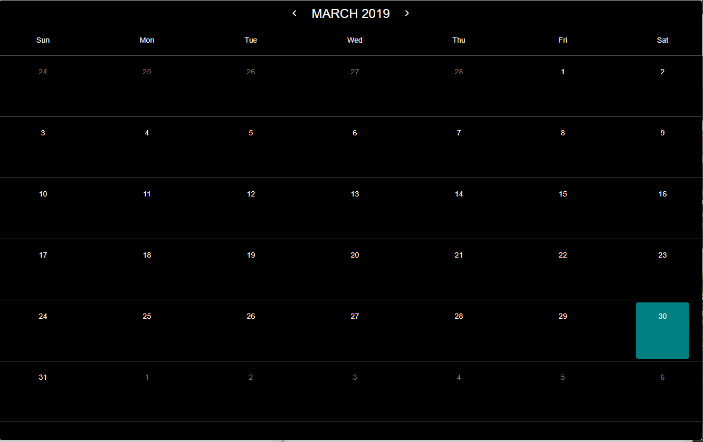
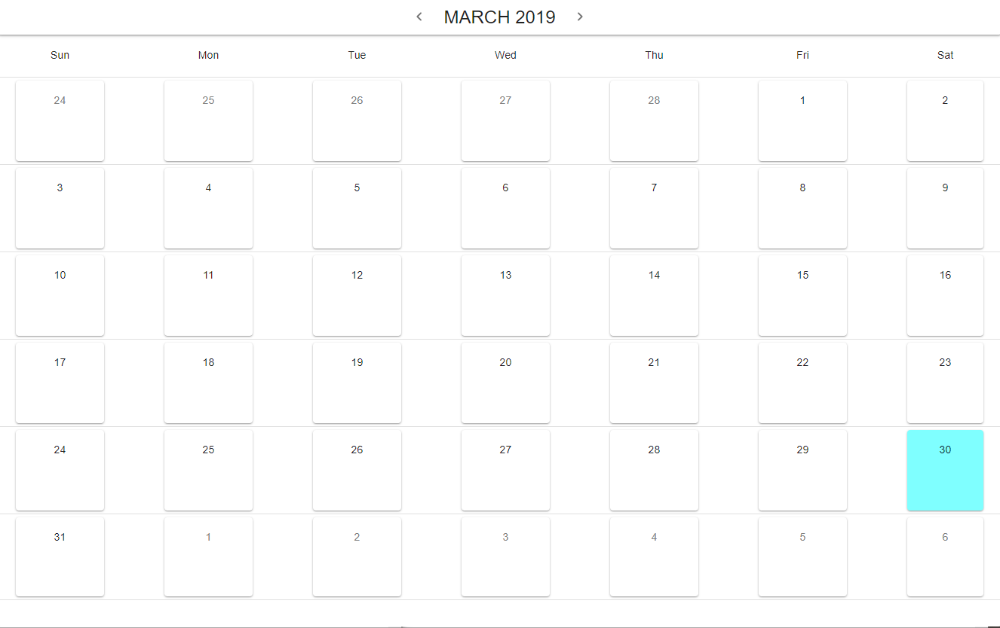

# react-material-ui-calendar

> React calendar using material-ui

[](https://www.npmjs.com/package/react-material-ui-calendar) [](https://standardjs.com)

## Install

```bash
npm install --save react-material-ui-calendar
```

## Example/Demo

Check out the demo [HERE!](https://joswong.me/calendar)

## Usage

```jsx
import React, { Component } from "react";

import Calendar from "react-material-ui-calendar";

class Example extends Component {
  render() {
    return <Calendar />;
  }
}
```

## Props

| Props        | Arg type                                   |
| ------------ | ------------------------------------------ |
| generalStyle | inline style object                        |
| light        | boolean(default is false)                  |
| selection    | function                                   |
| modes        | string (default is "day", "month", "year") |

### generalStyle

generalStyle is a prop you can pass to the component to style the calendar window.

```jsx
export default class App extends Component {
  render() {
    return (
      <Calendar
        generalStyle={{
          maxWidth: "100%",
          margin: "0 auto",
          backgroundColor: "rgba(0,0,0,1)",
          height: "100%",
          overflow: "auto"
        }}
      />
    );
  }
}
```



### light

light mode turns the normal white text to black text. Default is set to false for dark mode.

```jsx
export default class App extends Component {
  render() {
    return (
      <Calendar
        generalStyle={{
          maxWidth: "100%",
          margin: "0 auto",
          backgroundColor: "rgba(256,256,256,1)",
          height: "100%",
          overflow: "auto"
        }}
        light={true}
      />
    );
  }
}
```



### selection

If you wish have the component return the selection, you can pass a function to the selection prop like below.

```jsx
import React, { Component } from "react";

import Calendar from "react-material-ui-calendar";

export default class App extends Component {
  callBackFunction = value => {
    console.log("The selection is  -> ", value);
  };
  render() {
    return (
      <Calendar
        generalStyle={{
          maxWidth: "100%",
          margin: "0 auto",
          backgroundColor: "rgba(0,0,0,1)",
          height: "100%",
          overflow: "auto"
        }}
        selection={this.callBackFunction}
      />
    );
  }
}
```

### mode selection - day

This is the default mode and will display the regular calendar for users to select a day.
mode="day" is not required.

```jsx
export default class App extends Component {
  callBackFunction = value => {
    console.log("The selection is  -> ", value);
  };
  render() {
    return (
      <Calendar
        generalStyle={{
          maxWidth: "100%",
          margin: "0 auto",
          backgroundColor: "rgba(0,0,0,1)",
          height: "100%",
          overflow: "auto"
        }}
        selection={this.callBackFunction}
        mode="day"
      />
    );
  }
}
```

### mode selection - month

Displays the twelve months of the year for users to select the month.
The return values for months start at 0 for January, 1 for Febuary, etc.
eg. If you selected July, the return month is 6.

```jsx
export default class App extends Component {
  callBackFunction = value => {
    console.log("The selection is  -> ", value);
  };
  render() {
    return (
      <Calendar
        generalStyle={{
          maxWidth: "100%",
          margin: "0 auto",
          backgroundColor: "rgba(0,0,0,1)",
          height: "100%",
          overflow: "auto"
        }}
        selection={this.callBackFunction}
        mode="month"
      />
    );
  }
}
```


### mode selection - year

Displays the years for users to select.

```jsx
export default class App extends Component {
  callBackFunction = value => {
    console.log("The selection is  -> ", value);
  };
  render() {
    return (
      <Calendar
        generalStyle={{
          maxWidth: "100%",
          margin: "0 auto",
          backgroundColor: "rgba(0,0,0,1)",
          height: "100%",
          overflow: "auto"
        }}
        selection={this.callBackFunction}
        mode="year"
      />
    );
  }
}
```


## License

MIT © [joswong13](https://github.com/joswong13)
